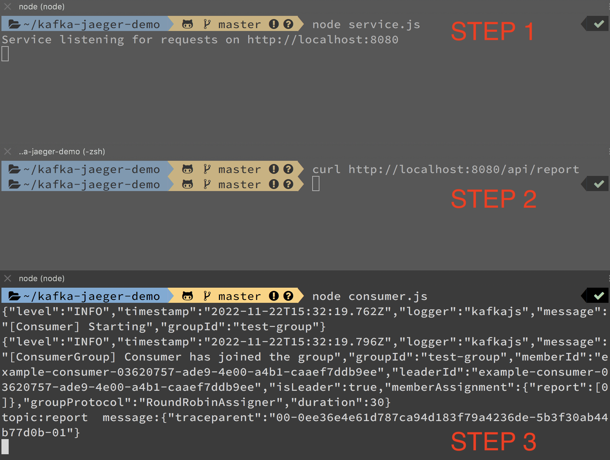

# 透過 Jaeger with OpenTelemetry 追蹤 Kafka 資料傳遞路徑與運行狀況（使用 W3CTraceContextPropagator 自定義 Parent & Child 關聯性）

我們可以把 Kafka 當成傳遞消息的「轉運站」，但有時就算 Consumer 順利拿到 Producer 的消息，我們也無法保證接下來的運作都符合預期。

而且會用到 Kafka 的系統，大多以微服務（Microservices）為主；若沒有搭配合適的追蹤系統，我們很難排查 Consumer 收到消息後發生的錯誤。

> 這篇文章以實作和邏輯講解為主，如果想了解 Jaeger 這個分布式追蹤系統，請參考[連結](https://medium.com/dean-lin/790e8d7a39a3)；想了解 Kafka 這個分布式消息串流平台，請參考[連結1](https://medium.com/dean-lin/4fd74d106a79)、[連結2](https://medium.com/dean-lin/e0c83b9aeacd)

建議讀者直接到[筆者的 Github](https://github.com/dean9703111/kafka-jaeger-demo) Clone 一份下來跑跑看，會更好理解裏面的邏輯。

```
大綱

一、自定義追蹤的 Parent & Child 關聯（Manually propagating span context）
二、使用 Kafka 作為傳遞資料的轉運站
三、在 Local 建立 Node.js 專案來達成目標
四、啟動專案，透過 Jaeger UI 確認 Trace 路徑是否符合預期
```

### ㄧ、自定義追蹤的 Parent & Child 關聯（Manually propagating span context）

其實 OpenTelemetry 有提供許多 Instrumentation 的方案，如：
- [@opentelemetry/instrumentation-http](https://www.npmjs.com/package/@opentelemetry/instrumentation-http)
- [@opentelemetry/instrumentation-grpc](https://www.npmjs.com/package/@opentelemetry/instrumentation-grpc)
- [opentelemetry-instrumentation-kafkajs](https://www.npmjs.com/package/opentelemetry-instrumentation-kafkajs)

透過上面的套件可以自動產生追蹤紀錄，但有時我們只需要追蹤特定路徑，而使用上面的套件會產生許多不需要的資訊，還容易產生效能瓶頸。
> 比如使用「instrumentation-http」這款套件時，它會把所有 http 相關的操作都記錄下來，但我們實際上只關心其中的幾個路徑。

因此在某些情況下，自定義追蹤的 Parent & Child 關聯是有必要的；下面筆者擷取關鍵的程式碼來做說明：
#### ➤ 透過 W3CTraceContextPropagator 把 span 資訊 inject 到 carrier
```js
let span = tracer.startSpan('example');
const carrier = {};
const propagator = new W3CTraceContextPropagator();
propagator.inject(
    api.trace.setSpanContext(api.context.active(), span.spanContext()),
    carrier,
    api.defaultTextMapSetter,
);
span.end()
```
#### ➤ 透過 W3CTraceContextPropagator extract carrier 資訊，使其成為能使用的 Context
```js
const propagator = new W3CTraceContextPropagator();
// 解析 carrier
const parentCtx = propagator.extract(api.context.active(), carrier, api.defaultTextMapGetter);
// 設定 parent 關聯
const span = tracer.startSpan(`report_consumer`, undefined, parentCtx);
span.end()
```

### 二、使用 Kafka 作為傳遞資料的轉運站

假使今天有個功能是「產出報表」，但它的執行時間長達「3 分鐘」；我想正常的使用者是不會等一隻 API 回傳等這麼久，針對這個議題，我們不妨改個思路：
1. 在報表的 Table 新增一個「status」欄位，用來表達報表建立的狀況（init、processing、done、fail）。
2. 前端呼叫產出報表的 API 時
    - 在報表的 Table 新增初始資訊，並將 Status 設定為「init」。
    - 將相關資訊透過 Producer 塞入 Kafka。
2. 前端收到 API 回傳的報表 id 後
    - 透過 Consumer 監聽報表執行的狀況；可以用報表的 id 作為 Topic 命名邏輯，ex：reports/{id}。
3. 監聽產出報表的 Consumer 從 Kafka 收到命令後
    - 透過 id 從資料庫撈出對應的報表資訊，將 Status 設定為「processing」。
    - 呼叫相關服務產出報表，如果其中一個服務發生錯誤，就將 Status 設定為「fail」。
    - 如果報表順利產出，就將 Status 設定為「done」。
    > 上面對 Status 的任何變動，都會透過 Producer 將資訊傳遞到 reports/{id} 這個 Topic，讓前端監聽的的 Consumer 可以作出對應的變動。

上面是比較完整的業務邏輯，建議讀者可以自行實做看看，下面筆者就單純放透過 Kafka 傳遞 carrier 資訊的部分：
#### ➤ 在 Producer 的 value 放上 carrier 的資訊（記得要轉為字串）
```js
await producer.connect()
await producer
  .send({
    topic,
    messages: Array({
      key: `report`,
      value: JSON.stringify(carrier)
    })
  });
```
#### ➤ 從 Consumer 收到的 message 中取出 carrier 的資訊
```js
await consumer.connect()
await consumer.subscribe({ topic, fromBeginning: true })
await consumer.run({
  eachMessage: async ({ topic, partition, message }) => {
    console.log("topic:" + topic + "  message:" + message.value)
    const carrier = JSON.parse(message.value)
  },
})
```

### 三、在 Local 建立 Node.js 專案來達成目標

專案的目標就如同標題，我們要透過 Jaeger with OpenTelemetry 追蹤 Kafka 資料傳遞路徑與運行狀況。

**STEP 1**：建立專案、安裝必要套件。
```
mkdir -p kafka-jaeger-demo
cd kafka-jaeger-demo
mkdir -p deploy/kafkaCluster/kraft

npm init -f

npm install --save @opentelemetry/api
npm install --save @opentelemetry/resources
npm install --save @opentelemetry/semantic-conventions
npm install --save @opentelemetry/sdk-trace-base
npm install --save @opentelemetry/exporter-jaeger
npm install --save axios
npm install --save express
npm install --save kafkajs
```

**SETP 2**：新增「docker-compose.yml」貼上如下程式，並將其啟動。

```yml
version: '2.0'
services:
  jaeger:
    image: jaegertracing/all-in-one:1.38 # 當時用 1.39 或 latest 有出現一些 bug，故選用此版本
    environment:
      - COLLECTOR_ZIPKIN_HOST_PORT=:9411
    ports:
      - "5775:5775/udp"
      - "6831:6831/udp"
      - "6832:6832/udp"
      - "5778:5778"
      - "16686:16686"
      - "14250:14250"
      - "14268:14268"
      - "14269:14269"
      - "9411:9411"
  kafka:
    image: 'bitnami/kafka:latest'
    ports:
      - '9092:9092'
    environment:
      - KAFKA_ENABLE_KRAFT=yes
      - KAFKA_CFG_PROCESS_ROLES=broker,controller
      - KAFKA_CFG_CONTROLLER_LISTENER_NAMES=CONTROLLER
      - KAFKA_CFG_LISTENERS=PLAINTEXT://:9092,CONTROLLER://:9093
      - KAFKA_CFG_LISTENER_SECURITY_PROTOCOL_MAP=CONTROLLER:PLAINTEXT,PLAINTEXT:PLAINTEXT
      - KAFKA_CFG_ADVERTISED_LISTENERS=PLAINTEXT://127.0.0.1:9092
      - KAFKA_BROKER_ID=1
      - KAFKA_CFG_CONTROLLER_QUORUM_VOTERS=1@127.0.0.1:9093
      - ALLOW_PLAINTEXT_LISTENER=yes
    volumes:
        # 這是設定資料要存在哪路的路徑
      - ./deploy/kafkaCluster/kraft:/bitnami/kafka:rw
```

接著輸入以下指令拉下＆啟動 Kafka & Jaeger 環境。

```
docker-compose up -d
```

**STEP 3**：新增「tracing.js」貼上如下程式，基本上就是「Opentelemetry」的基礎運用。

```js
'use strict';

const opentelemetry = require('@opentelemetry/api');
const { Resource } = require('@opentelemetry/resources');
const { SemanticResourceAttributes } = require('@opentelemetry/semantic-conventions');
const { BasicTracerProvider, BatchSpanProcessor } = require('@opentelemetry/sdk-trace-base');
const { JaegerExporter } = require('@opentelemetry/exporter-jaeger');

module.exports = (serviceName) => {
    const provider = new BasicTracerProvider({
        resource: new Resource({
            [SemanticResourceAttributes.SERVICE_NAME]: serviceName,
        })
    });

    let exporter;
    exporter = new JaegerExporter({ endpoint: "http://127.0.0.1:14268/api/traces" });

    provider.addSpanProcessor(new BatchSpanProcessor(exporter));

    // Initialize the OpenTelemetry APIs to use the NodeTracerProvider bindings
    provider.register();

    return opentelemetry.trace.getTracer('my-service-tracer');
};
```

**STEP 4**：新增「service.js」貼上如下程式；我們在這裡建立供使用者呼叫的 API（/api/report），當 API 被呼叫後會開始追蹤，並透過 Producer 將資料塞入 Kafka。

```js
const api = require('@opentelemetry/api');
const tracer = require('./tracing')('service');
const express = require("express");
const PORT = "8080";
const app = express();
const { Kafka, logLevel } = require('kafkajs')
const kafka = new Kafka({
  logLevel: logLevel.ERROR,
  brokers: [`localhost:9092`],
  clientId: 'example-producer',
})
const producer = kafka.producer()
const topic = 'report'
const { W3CTraceContextPropagator } = require('@opentelemetry/core');

async function report(parentSpan) {
  try {
    const ctx = api.trace.setSpan(
      api.context.active(),
      parentSpan
    );
    let span = tracer.startSpan('report_producer', undefined, ctx);
    const carrier = {};
    const propagator = new W3CTraceContextPropagator();
    propagator.inject(
      api.trace.setSpanContext(api.context.active(), span.spanContext()),
      carrier,
      api.defaultTextMapSetter,
    );
    await producer.connect()
    await producer
      .send({
        topic,
        messages: Array({
          key: `report`,
          value: JSON.stringify(carrier)
        })
      });
    span.end()
  } catch (e) {
    console.log(e)
    throw e
  }
}
app.get("/api/report", async (req, res) => {
  try {
    let span = tracer.startSpan('report_request');
    let result = await report(span)
    span.end()
    res.send(result);
  } catch (e) {
    res.send(e);
  }
});

app.listen(parseInt(PORT, 10), () => {
  console.log(`Service listening for requests on http://localhost:${PORT}`);
});
```

**STEP 5**：新增「consumer.js」貼上如下程式；專門監聽「report」這個 Topic，收到 message 後會開始做後續的處理（有刻意設計一個執行錯誤的結果）。

```js
const api = require('@opentelemetry/api');
const tracer = require('./tracing')('consumer');
const { W3CTraceContextPropagator } = require('@opentelemetry/core');
const { Kafka, logLevel } = require('kafkajs')
const kafka = new Kafka({
  logLevel: logLevel.INFO,
  brokers: [`localhost:9092`],
  clientId: 'example-consumer',
})
const topic = 'report'
const consumer = kafka.consumer({ groupId: 'test-group' })

const run = async () => {
  await consumer.connect()
  await consumer.subscribe({ topic, fromBeginning: true })
  await consumer.run({
    eachMessage: async ({ topic, partition, message }) => {
      console.log("topic:" + topic + "  message:" + message.value)
      const carrier = JSON.parse(message.value)
      const propagator = new W3CTraceContextPropagator();
      const parentCtx = propagator.extract(api.context.active(), carrier, api.defaultTextMapGetter);
      if (topic === "report") {
        const span = tracer.startSpan(`report_consumer`, undefined, parentCtx);
        report(span)
        span.end()
      }
    },
  })
}

function report(parentSpan) {
  const parentCtx = api.trace.setSpan(
    api.context.active(),
    parentSpan
  );
  let span = tracer.startSpan('handle_report', undefined, parentCtx);
  for (let i = 0; i < 10; i++) {
    doWork(span, i);
  }
  span.end();
}
function doWork(parentSpan, i) {
  const parentCtx = api.trace.setSpan(
    api.context.active(),
    parentSpan
  );
  let span = tracer.startSpan(`doWork:${i}`, undefined, parentCtx);
  // 讓每個執行的時間不一樣
  for (let i = 0; i <= Math.floor(Math.random() * 40000000); i++) {
    // empty
  }
  if (i === 5) { // 產生錯誤訊息
    span.recordException(new Error(`doWork:${i} error`));
    span.setStatus({ code: api.SpanStatusCode.ERROR, message: "Something wrong!" });
    span.addEvent('log', {
      'log.severity': 'error',
      'log.message': 'doWork:${i} error'
    });
  }
  span.end();
}

run().catch(e => console.error(`[example/consumer] ${e.message}`, e))

const errorTypes = ['unhandledRejection', 'uncaughtException']
const signalTraps = ['SIGTERM', 'SIGINT', 'SIGUSR2']
// 收到無法處理錯誤時的處理
errorTypes.forEach(type => {
  process.on(type, async e => {
    try {
      console.log(`process.on ${type}`)
      console.error(e)
      await consumer.disconnect()
      process.exit(0)
    } catch (_) {
      process.exit(1)
    }
  })
})
// 收到中斷訊號時的處理
signalTraps.forEach(type => {
  process.once(type, async () => {
    try {
      await consumer.disconnect()
    } finally {
      process.kill(process.pid, type)
    }
  })
})
```

### 四、啟動專案，透過 Jaeger UI 確認 Trace 路徑是否符合預期

> 建議使用有分頁功能的終端機（如 iTerm2），這樣比較好觀察與操作。

**STEP 1**：在專案根目錄下輸入 `node service.js` 啟動 Service。
**STEP 2**：在終端機貼上指令 `curl http://localhost:8080/api/report` 來呼叫 API。
**STEP 3**：在專案根目錄下輸入 `node consumer.js` 啟動監聽模式；這邊提醒一下，如果監聽不存在的 Topic 會報錯。



**STEP 4**：到 Jaeger UI 上（http://localhost:16686/search）確認 Trace 路徑是否符合預期。


下圖「report_producer」跟「report_consumer」之間的空白，就是 Kafka 的時間。


範例到這裡告一段落，希望文中 Jaeger 與 Kafka 的組合應用，有幫讀者打開不一樣的思路。